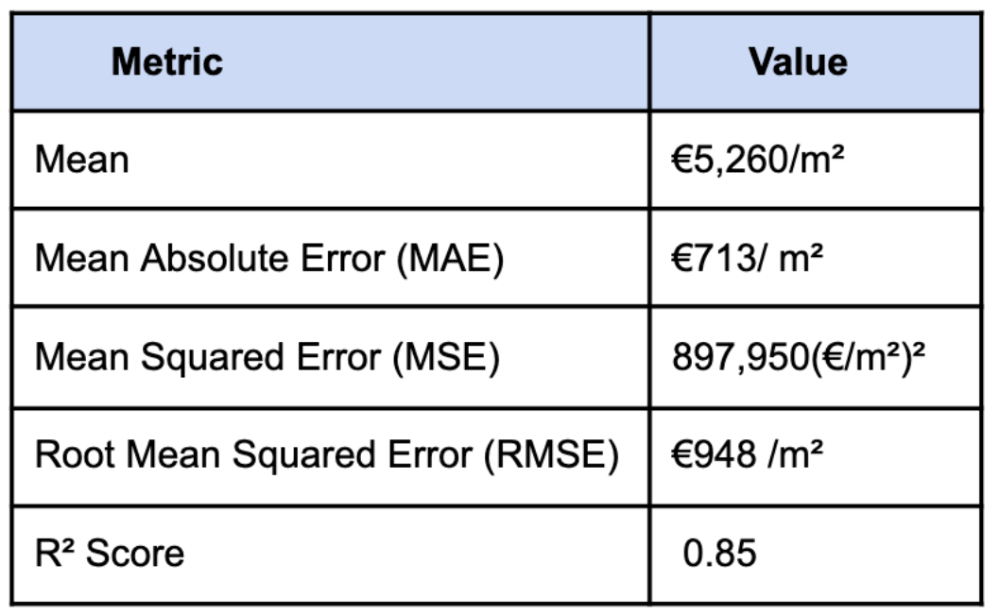
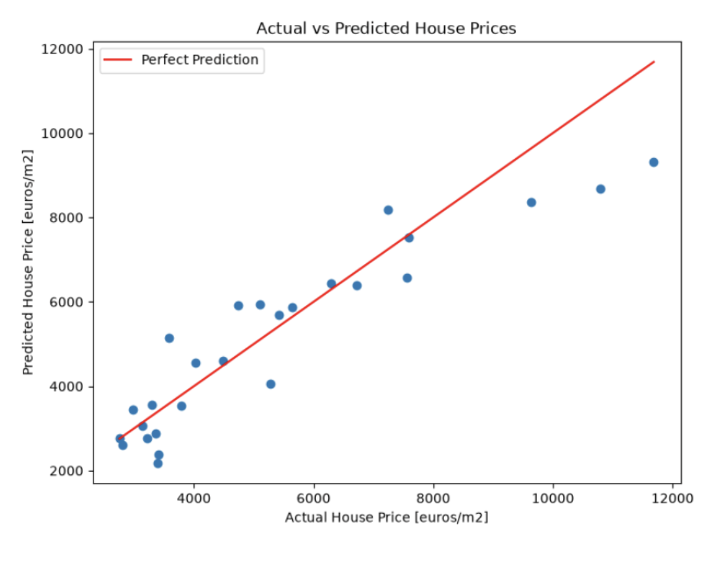

# Madrid Housing Price Prediction

**Python | Pandas | NumPy | scikit-learn | Matplotlib | Seaborn | Machine Learning | Data Analysis**

A Python machine learning project exploring whether socioeconomic indicators can be used to predict average housing prices across Madrid neighbourhoods.

Using two official Madrid City Council datasets, I cleaned and combined neighbourhood-level data, selected 15 socioeconomic features, explored relationships within the data, trained a Linear Regression model and evaluated its performance on unseen test data.

## Technical Skills Demonstrated

- Python programming
- Data cleaning and preprocessing
- Working with multiple real-world datasets
- Exploratory data analysis (EDA)
- Data visualisation
- Feature selection
- Linear Regression
- Model training and evaluation
- Interpretation of model performance
- Debugging data-quality and merging issues
- Git and GitHub
- Technical documentation

## Results

A Linear Regression model was trained using an 80:20 train-test split, with a fixed random state for reproducibility.

The model achieved:

- **R² Score:** 0.85
- **Mean Absolute Error (MAE):** €713/m²
- **Root Mean Squared Error (RMSE):** €948/m²
- **Mean Squared Error (MSE):** 897,950 (€/m²)²
- **Mean housing price:** €5,260/m²

Approximately **30% of predictions were within 5% of the actual housing price**, while **77% were within 20%**.

### Model Performance Metrics



### Actual vs Predicted Housing Prices



The R² score indicates that the model explained a substantial proportion of the variation in housing prices within the test data.

The difference between the MAE and RMSE suggests that, although the model performed reasonably well for many neighbourhoods, a smaller number of neighbourhoods produced larger prediction errors.

## Key Findings

Exploratory analysis identified relationships between several socioeconomic indicators and average housing prices.

In particular:

- Higher levels of **higher education** showed a strong positive relationship with housing prices.
- **Average disposable income per person** showed a strong positive relationship with housing prices.
- **Registered unemployment** showed a negative relationship with housing prices.

These relationships provided a useful foundation for the modelling process. However, correlation does not establish causation or necessarily indicate which variables make the strongest contribution when all predictors are considered together.

The analysis also highlighted differences in prediction accuracy between neighbourhoods, suggesting that some housing-price patterns may not be fully captured by a simple linear model.

## Description

The project combines two official datasets published by Madrid City Council:

- the **Panel of Socioeconomic Indicators of Districts and Neighbourhoods of Madrid**
- **Average Declared Housing Price (€ per m²) by District and Neighbourhood**

Following initial data inspection, the datasets were cleaned, relevant features were selected and the data was merged.

The final modelling dataset contained **130 residential Madrid neighbourhoods**, excluding the airport, with **15 selected socioeconomic indicators** and average housing price per square metre, based on 2025 data.

During data preparation, a mismatch between neighbourhood names across the two datasets was identified and corrected. This allowed the expected 130 neighbourhoods to be successfully merged, producing a final dataset with no missing values.

The project provides an initial exploration of the relationship between socioeconomic characteristics and housing prices across Madrid neighbourhoods.

While these relationships do not establish causation, they can help identify socioeconomic factors associated with differences in housing prices and neighbourhood conditions.

With the addition of historical data, future versions could explore how changes in socioeconomic conditions relate to housing prices over time.

## Selected Features

The 15 socioeconomic indicators selected for modelling were:

- Population density (inhabitants per hectare)
- Population aged 25+ with higher education or technical qualifications (%)
- Registered housing as a percentage of total registered premises
- Average disposable income per person
- Average annual net household income
- Registered unemployment rate
- Population growth rate (%)
- Average household size
- Average age
- Ageing index (% aged 65+)
- Social welfare and equality vulnerability index
- Economic and employment vulnerability index
- Education and culture vulnerability index
- Urban environment and mobility vulnerability index
- Health vulnerability index

## Tools and Libraries

### Tools

- **Jupyter Notebook** – used to explore and clean the datasets, perform analysis, and develop and evaluate the machine learning model.
- **Microsoft Excel** – used to support the initial analysis and selection of relevant socioeconomic indicators.

### Python Libraries

- **Pandas** – data manipulation, cleaning and analysis
- **NumPy** – numerical operations
- **Matplotlib** – data visualisation
- **Seaborn** – statistical data visualisation
- **Scikit-learn** – data preprocessing, model development and evaluation

## Methodology

The project followed a standard machine learning workflow:

1. **Data inspection** – inspected the structure, data types and contents of both datasets.
2. **Feature selection** – reviewed the available socioeconomic indicators and selected 15 features for modelling.
3. **Data cleaning and preparation** – filtered the datasets to 2025, corrected data types, renamed columns, created a merge key and prepared the selected features.
4. **Exploratory data analysis** – explored distributions and relationships between socioeconomic indicators and housing prices.
5. **Model preparation** – defined average housing price per square metre as the target variable and prepared the selected predictors.
6. **Train-test split** – divided the data into 80% training data and 20% test data.
7. **Model development** – built and trained a Linear Regression model.
8. **Prediction and interpretation** – compared predicted and actual housing prices and calculated percentage differences.
9. **Model evaluation** – evaluated performance using MAE, MSE, RMSE and R².
10. **Review and improvements** – identified limitations and potential improvements for future versions of the model.

## Challenges and Problem Solving

Working with raw real-world data required substantial cleaning and reformatting before modelling.

Challenges included:

- CSV metadata within the source data
- An unexpected semicolon separator
- Spanish-language column names and information
- Selecting relevant features from a large number of available socioeconomic indicators
- Resolving inconsistent neighbourhood names between the two datasets
- Visualising the results of a regression model containing multiple predictors

One particular challenge involved a mismatch between neighbourhood names in the two datasets. The mismatch was identified during the merging process and corrected, allowing the expected 130 neighbourhoods to be retained in the final dataset.

Because the regression used multiple predictors, it could not be represented using a simple two-dimensional regression plot. An **actual-versus-predicted housing price plot** was therefore used to visualise model performance.

## Limitations and Future Improvements

The project has several limitations.

The dataset contains only **130 observations from a single year**, while the model uses 15 predictor variables. This is relatively small for the number of features included and may increase the risk of overfitting.

Feature selection was based primarily on exploratory analysis rather than a supporting literature review or formal feature-selection method.

The analysis also identifies relationships between socioeconomic indicators and housing prices rather than establishing causal relationships.

Potential future improvements include:

- **Investigating outliers** – identify high-value neighbourhoods and assess whether they disproportionately influence the Linear Regression model.
- **Feature selection** – examine regression coefficients and use feature-selection techniques to determine which indicators contribute most when predictors are considered together.
- **Assessing overfitting** – compare performance on the training and test datasets to assess how well the model generalises to unseen data.
- **Alternative models** – compare Linear Regression with models such as Decision Tree, Random Forest or Gradient Boosting regressors.
- **Feature scaling** – standardise features measured on different scales where appropriate.
- **Feature engineering** – create additional derived features that may better represent relationships within the data.
- **Historical data** – incorporate previous years to capture longer-term trends and increase the amount of data available for modelling.

These developments could help determine whether non-linear models or a more refined set of predictors can improve predictive performance.

## Getting Started

### Prerequisites

- Python
- pip
- Jupyter Notebook

### Installation

Install the required Python packages:

```bash
pip install -r requirements.txt
```

### Project Structure

- `data/` – original and cleaned datasets
- `notebooks/` – data exploration, preparation and modelling notebooks
- `outputs/` – files produced during analysis
- `project_report.pdf` - accompanying project report
- `requirements.txt` – required Python packages


### Executing the Program

Run the notebooks in numerical order from the `notebooks/` directory.

## Author

Charlie Smith – @CharlieSm49

## Version History

0.1 – Initial Release

## Acknowledgments

- Developed as part of the Coding Black Females Python and Machine Learning programme.
- Thank you to Obe for teaching and guidance throughout the course.
- Data sourced from Madrid City Council.
